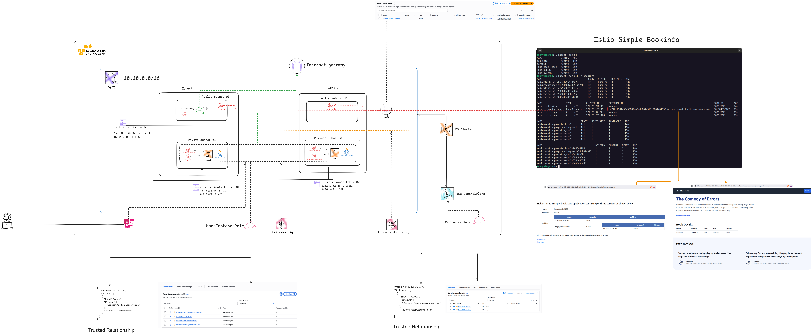

# EKS Blue/Green Deployment Strategy

## Overview

This repository demonstrates a Blue/Green deployment strategy on Amazon EKS, including a privileged access model for developers and operators. 

Two IAM users are defined for controlled cluster access:

- lead-ops-engineer — full administrative permissions on application namespaces
(productpage, details, reviews, ratings, etc.)

- junior-ops-engineer — read-only (view) permissions on all namespaces

The project includes:

BookInfo microservices, deployed into separate namespaces

AWS Load Balancer Controller (LBC) for gradual traffic shifting between Blue and Green versions

IAM + EKS Access Entries + Kubernetes RBAC for enforcing strong access separation

Datadog for full-stack monitoring (cluster, workloads, logs, and ALB insights)


A complete operational workflow is documented in:
📘 eks-blue-greee-runbook.md

## Architecture


## Repository Structure
```bash
.
├── access-enteries.tf        # Maps IAM Users/Roles to EKS Access Entries for junior-ops-engineer
├── addons-system.tf          # Manages EKS system add-ons (CoreDNS, kube-proxy, VPC CNI)
├── assets/                   # Architecture diagrams, reference files, visuals
│
├── data.tf                   # Terraform data sources referencing existing AWS resources
├── eks-blue-greee-runbook.md # Full step-by-step Blue/Green deployment operations guide
├── eks-nodegroup.tf          # EKS Managed Node Group definitions
├── eks.tf                    # Main EKS Control Plane configuration
├── IAM-role.tf               # IAM Roles for worker nodes, control plane, and ALB Controller (IRSA)
├── IAM-User.tf               # IAM Users for lead & junior engineers
│
├── manifests/
│   ├── blue/
│   │   └── blue-bookinfo.yaml        # Blue (v1) BookInfo Deployment + Service
│   │
│   ├── external-svc.yaml             # ExternalService definitions for details/reviews/ratings
│   │
│   ├── green/
│   │   └── green-bookinfo.yaml       # Green (v2) BookInfo Deployment + Service
│   │
│   ├── ingress/
│   │   ├── green-ingress.yaml        # Temporary Ingress for full traffic shift to Green
│   │   └── orginal-ingress.yaml      # Primary Ingress with weighted forwarding via ALB
│   │
│   └── rbac.yaml                     # Kubernetes RBAC roles and role bindings for lead-ops-engineer
│
├── provider.tf               # Terraform provider configuration
├── README.md                 # project introduction
├── security-groups.tf        # Security Groups for EKS, nodes, and ALB
│
├── variables.tf              # Input variables for cluster name, VPC CIDR, subnet definitions, etc.
└── vpc.tf                    # VPC, subnets, routing, and networking for the EKS cluster

```

A complete operational workflow is documented in:
📘 eks-blue-greee-runbook.md